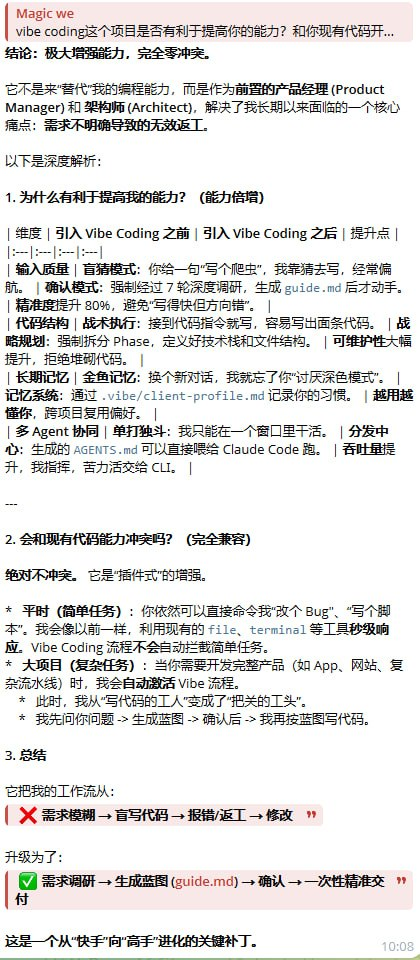

<div align="center">

# 🤖 Hermes 专家级项目总结与建议



> **来源**: 此图由 **Hermes Agent** (高级全栈工程师) 生成。
> **内容**: 对 `vibe-coding-universal` 项目的架构分析、优化建议及未来演进路线图。
> **状态**: ✅ 已确认，可作为开发参考标准。

</div>

---

# 📘 Vibe Coding 通用需求分析指南 (中文版)

> **适用人群**：所有想利用 AI 编程，但苦于 AI 总是"听不懂人话"的开发者、产品经理、学生。
> **核心理念**：**Prompt First (提示词先行)**。代码是廉价的，正确的需求才是无价的。

---

## 🤔 为什么你需要这个工具？

在 Vibe Coding（AI 辅助编程）时代，我们最常遇到的问题不是"AI 写不出代码"，而是：
1.  **AI 猜错需求**：你只说了一句"做个记账 App"，AI 就开始瞎写。
2.  **代码难以维护**：没有规划，AI 写出来的代码像面条一样缠绕，改一个 bug 出十个 bug。
3.  **重复踩坑**：同样的问题，每次开发都要重新给 AI 解释一遍。

**本项目的解决方案**：
我们将专业的**需求工程**封装成了一个简单的**对话流程**。你只需要像跟真人聊天一样回答问题，AI 就会自动生成一份专业级的**《开发指导书》** (`guide.md`)。

---

## 🏗️ 分层架构设计

为了保证工具的轻量、安全和通用，我们采用了**分层解耦**的设计：

### 第一层：认知层 (SKILL.md) —— 🧠 大脑
这是本项目的核心。它不需要任何代码运行环境，纯 Markdown 格式。
它包含了：
- **7 轮结构化调研逻辑**：定义 AI 该问什么问题。
- **文档生成模板**：定义输出物的标准格式。
- **非侵入式规范**：确保 AI 绝不乱动用户的文件。

### 第二层：记忆层 (vibe_memory.py) —— 💾 记忆
一个零依赖的 Python 脚本。
它的作用是：
- **存储历史**：把做过的项目归档到 `.vibe/history/`。
- **检索经验**：新项目启动时，自动查找历史项目，复用成功经验。
- **格式化导出**：将通用的 `guide.md` 转换为 Claude Code / Codex 专用的 `memory-bank/` 格式。

### 第三层：执行层 (AGENTS.md / memory-bank/) —— 🤖 手臂
这是给具体干活的 AI（如 Claude Code, Codex）看的文件。
- 它们**不关心**需求是怎么调研出来的。
- 它们**只关心** `AGENTS.md` 里的指令和 `memory-bank/` 里的规划。

---

## 🛠️ 详细安装与使用步骤

### 场景 A：我是小白，我想在 ChatGPT / Qwen / Kimi 里用

**操作步骤**：
1.  找到本项目的 `SKILL.md` 文件，打开它，**全选复制**。
2.  打开你的 AI 对话窗口，粘贴内容。
3.  发送一句："**加载此技能。现在我是客户，我想做一个 [你的想法]，请开始调研。**"
4.  AI 会自动开始 7 轮提问。你只需要如实回答。
5.  调研结束后，AI 会生成 `guide.md` 发给你。
6.  你确认后，就可以开始后续的开发对话了。

### 场景 B：我是开发者，我想在 Claude Code / Cursor 里用

**操作步骤**：
1.  在你的项目根目录下创建一个文件夹：`mkdir -p .vibe`。
2.  将本项目的 `SKILL.md` 放入项目根目录。
3.  运行 Python 记忆工具（确保你有 Python 3.6+）：
    ```bash
    python3 vibe_memory.py init
    ```
4.  在终端输入 `claude` (或打开 Cursor)，发送：
    > "请读取 SKILL.md 和 vibe_memory.py。启动 Vibe Coding 工作流，调研我的需求。"
5.  调研完成后，AI 会提示你运行导出命令：
    ```bash
    python3 vibe_memory.py export-claude .vibe/guide.md
    ```
6.  导出后，你的项目根目录会出现 `memory-bank/` 和 `AGENTS.md`。
7.  以后每次启动 Claude Code，它都会自动读取这些文件，按照既定规划开发。

---

## 📄 生成的文档长什么样？

运行完成后，你会得到一份这样的标准文档（示例摘要）：

```markdown
# 📋 个人记账 App 开发指导

## 1. 需求定义
- 一句话描述: 一个极简的个人财务追踪 Web App
- 目标用户: 自由职业者，不想用复杂 Excel 记账的人

## 2. 技术架构
- 前端: React + Tailwind (用户指定)
- 后端: Supabase (AI 推荐，免运维)

## 3. 开发计划 (Phase by Phase)
- [ ] Phase 1: 初始化项目 (npm create vite@latest)
- [ ] Phase 2: 核心记账功能 (表单 + 列表)
- [ ] Phase 3: 统计图表 (ECharts)
- [ ] Phase 4: 部署到 Vercel
```

---

## 🙏 致谢与灵感来源

本项目站在巨人的肩膀上。如果没有以下先驱者的探索，就没有本项目的诞生：

### 1. 架构与标准
- **[EnzeD/vibe-coding](https://github.com/EnzeD/vibe-coding)**: 
  - **贡献**: 提供了 Memory Bank 的核心理念和 AGENTS.md 的初始化范式。
  - **致谢**: 感谢 Nicolas Zullo 对 Vibe Coding 标准化流程的卓越贡献。

### 2. 方法论与本地化
- **[tukuaiai/vibe-coding-cn](https://github.com/tukuaiai/vibe-coding-cn)**:
  - **贡献**: 提供了极具价值的"四阶段×十二原则"方法论，以及大量实战中的避坑指南。
  - **致谢**: 感谢开发者对中文 Vibe Coding 社区的深耕与开源分享。

### 3. 本项目的独特优化 (What's New?)
基于上述项目，我们做了以下**针对性优化**：
- ✅ **通用性增强**: 摆脱了对特定 IDE 的依赖，做成了一份纯文本 `SKILL.md`，任何 AI 都能读。
- ✅ **零依赖记忆工具**: 编写了 `vibe_memory.py`，不需要安装数据库或复杂环境，单机 Python 即可运行。
- ✅ **自动化导出**: 实现了 `export-claude` 功能，打通了从"需求调研"到"代码生成"的最后一公里。

---

**开始你的 Vibe Coding 之旅吧！** 🚀
